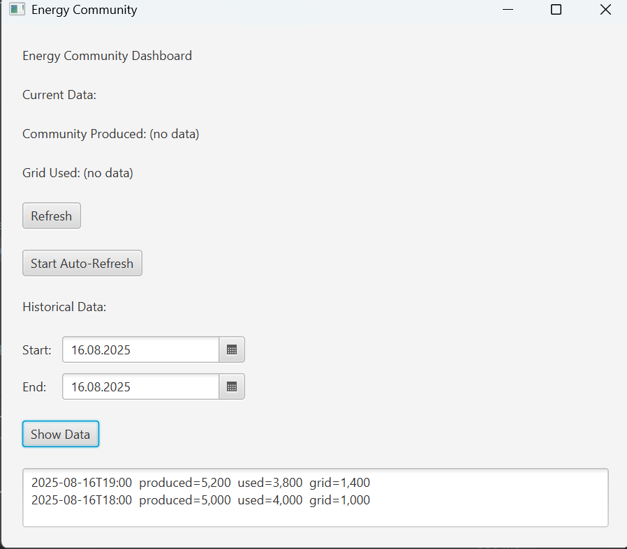

# EnergyCommunity

Distributed Systems Semester Project - FH Technikum Wien

## Project Overview
This project simulates an **Energy Community**, where energy production and consumption are collected and processed.
It consists of the following components:

- **PostgreSQL (Docker)** - stores all mesaurements
- **Spring Boot REST API** - provides endpoints for retrieving and injecting energy data
- **RabbitMQ** - message broker for communication between producers and consumers
- **JavaFX GUI** - visualization of energy data

---

## Startreihenfolge (Quickstart)
1. **Docker-Services starten**
    cd docker
    docker compose up -d
    - PostgreSQL -> Port **5432**
    - RabbitMQ -> Ports **5672** (AMQP) & **15672** (Web UI)
   
2. **REST-API starten**
    cd rest-api
    mvn spring-boot:run
    -> läuft auf http://localhost:8081
3. **GUI starten**
    Starte das JavaFX-Projekt (IDE "Run" oder mvn javafx:run, je nach Setup).
    Die GUI greift auf http://localhost:8081 zu.
## Ports
   | 🔌 Komponente | Port  | Beschreibung                  |
   |---------------|-------|-------------------------------|
   | REST-API      | 8081  | Backend API                   |
   | JavaFX GUI    | 8080  | (optional, wenn Web-GUI später) |
   | Postgres      | 5432  | Datenbank                     |
   | RabbitMQ      | 5672  | AMQP (Broker)                 |
   | RabbitMQ      | 15672 | Web UI (http://localhost:15672) |

## Datenbank-Schema & Migrationen
**Flyway** führt die Migrationen beim API-Start automatisch aus (rest-api/src/main/resources/db):
   | 🗃️ Version | Datei                        | Beschreibung                          |
   |-------------|------------------------------|---------------------------------------|
   | V1          | V1__energy_reading.sql       | Basis-Tabelle `energy_reading`        |
   | V2          | V2__usage_hourly.sql         | View/Aggregation pro Stunde           |
   | V3          | V3__current_percentage.sql   | View/Aggregation „aktueller Stand“ (+ Indizes) |

## REST-Schnittstelle (Beispiele)

### 1) Aktueller Stand
**Request:**  
GET http://localhost:8081/energy/current

**Beispiel-Antwort:**
``` json
{
   "hourIso": "2025-08-16T19:00",
   "communityProduced": 5.2,
   "communityUsed": 3.8,
   "gridUsed": 1.4
}
```
### 2) Historische Daten (inkl. beider Grenztage)
**Request**
GET http://localhost:8081/energy/historical?start=2025-08-16&end=2025-08-16

**Bespiel-Antwort**
``
{
    "hourIso": "2025-08-16T19:00"
    "communityProduced": 5.2,
    "communityUsed": 3.8,
    "gridUsed": 1.4
},
{
    "hourIso": "2025-08-16T18:00",
    "communityProduced": 5.0,
    "communityUsed": 4.0,
    "gridUsed": 1.0
}
``
### 3) Neuen Messwert einspeisen (Ingress)
**Request**
POST http://localhost:8081/ingress/reading
Content-Type: application/json

**Beispiel-Antwort**
``` json
{
  "rescordedAT": "2025-08-16T18:35:00",
  "communityProduced": 5.2,
  "communityUsed": 3.8,
  "gridUsed": 1.4
}
```
### JavaFX GUI
Die Desktop-GUI zeigt:
- den **aktuellen Stand**
- sowie **historische Daten** (Start/End-Datum wählbar)

**Screenshot**


### RabbitMQ
- Web UI: http://localhost:15672 (Standard-Login: guest/guest)
- Producer/Consumer werden im nächsten Schritt ergänzt.

**Geplante Queues/Exchanges** (Vorschlag)
- Exchange: energy.topic (type: topic)
- Queue: energy.readings.ingress (blind: reading.created)
- Producer schickt neue Messwerte -> Consumer persistiert in DB

## ✅ Erledigt

- Docker-Setup für **Postgres & RabbitMQ**
- REST-API (**Current/Historical + Ingress**)
- Flyway-Migrationen **V1–V3 (+ Indizes)**
- JavaFX GUI (**aktueller & historischer View**)

## 🔜 Nächste Schritte

- ProducerService (**publish nach RabbitMQ**)
- ConsumerService (**consume & in DB speichern**)
- Optional: **Alert-Logik / weitere Vis**
